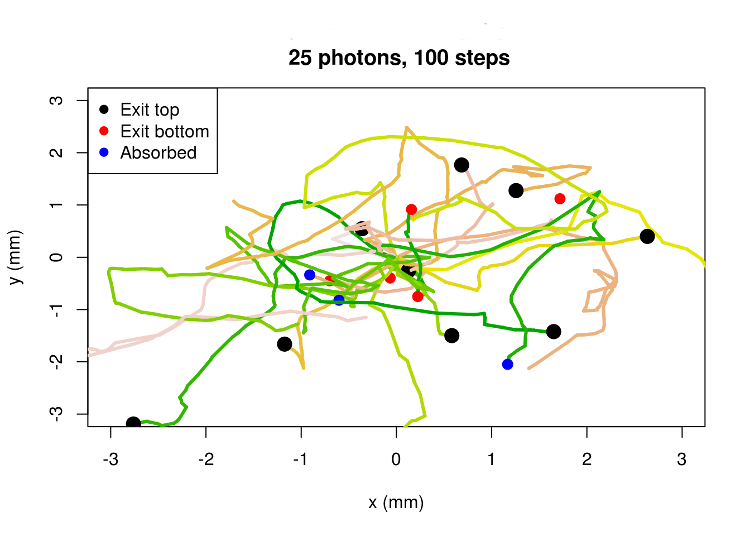

## We'd like to simulate here

```{r fig.show='hold', fig.align='center', fig.width=8, echo=FALSE}
source("../R/utilities.R")
fname <- "../data/subject04_crisp_v.rawb"
phantom <- readBin(fname, what="raw", n=362*434*362, size=1, signed=FALSE, endian="big")
dim(phantom) <- c(362, 434, 362)
v1a <- as.integer(phantom[175,,]);dim(v1a)<- c(434,362);disp_slice(v1a, main="BrainWeb Area 17 (Fovea)")
theta <- seq(0, 2*pi, length.out = 50)
polygon(60+20*cos(theta), 125+20*sin(theta), border ="yellow", lwd=8)
arrows(c(475, 475), c(25, 25), c(475, 525), c(75, 25), lwd=5, col="cyan")
text(475, 75, "z", cex=2, pos=3, col="cyan")
text(525, 25, "y", cex=2, pos=4, col="cyan")
```

## What Per does here

**ferret visual cortex**
```{r fig.show='hold', fig.align='center', fig.width=4, echo=FALSE}  
  library(png)
  img<-readPNG("../images/ferret_visual_areas.png")
  grid::grid.raster(img)
```

## We need

* A labeled phantom
* Optical and acoustic properties of tissue and dye
* Likely concentration of dye in brain
* NIR and US simulators
* Neural activity simulator

## We have

* A labeled phantom: BrainWeb from [McGill](http://brainweb.bic.mni.mcgill.ca/cgi/brainweb1?alias=subject04_crisp&download=1)
* Optical and acoustic properties of tissue and dye (??)
* Dye concentration estimate based on: ICG, FUS delivery (??)
* NIR simulator(s)
    + Monte Carlo photon-level
    + Deterministic voxel-level (being tested)
    + RTE solver ([Abhinav Jha](http://www.ncbi.nlm.nih.gov/pmc/articles/PMC3963433/))
* Prototype code for US and neural activity

## The phantom

* The BrainWeb discrete anatomical model of normal brain
* Each voxel is labeled by its majority tissue
* 1 mm^3^ voxels
* DL Collins, et. al., [Design and Construction of a Realistic Digital Brain Phantom](http://www.bic.mni.mcgill.ca/users/louis/papers/phantom/)

## Optical properties of tissue (??)

* Sparse and variable
* Steven L Jacques, Optical properties of biological tissues: a review, 2013, [Phys. Med. Biol. 58 R37](http://iopscience.iop.org/0031-9155/58/11/R37)
* [Inverse problem repository at github](http://brain-initiative.github.io/know_brainR/Rmds/jacques.html)

## Optical properties of tissue: Example

```{r echo=FALSE,fig.align='center', fig.show='hold'}
readme <- function(file)read.table(file, header=TRUE, sep=",", comment.char="#")
g <- readme("../data/anisotropy_coefficients.csv")
plot(g[,2],g[,3], type='n', xlab=expression(lambda~~(nm)), ylab="g (dimensionless)", main="Anisotropy Coefficients")
traces <- unique(g[,c(1,4)])
col <- 0
for(i in 1:nrow(traces)){
  idx <- (g[,1] == traces[i,1]) & (g[,4] == traces[i,2])
  temp <- g[idx,]
  col <- col+1
  lines(temp[,2], temp[,3], lwd=3, col=col)
  points(temp[,2], temp[,3], col=col, pch=19)
}
legend('bottomright', paste(traces[,1],"--",traces[,2]), lwd=3, col=1:nrow(traces), cex=.9) 
```

## Optical properties of dye (??)

**Peaks are real, spectral shapes are guesswork**

```{r echo=FALSE, fig.align='center', fig.show='hold'}
vsdSpectrum <- function(peak, width=300){
   # Create a function for a curve with a 675 nm peak
  # NOTE: the factor 300/lambda^2 comes from a change of variable
  # from frequency to wavelength.
  fsd <- (300/(675-.5*width) - 300/675)/2.5
  fcal <- function(lambda)dnorm(300/lambda, 300/675, fsd)*300/lambda^2
  # Return a function which translates the calibrated curve
  # to the correct peak wavelength and shift, and normalizes
  # it so its peak value is 1.
  function(lambda, depolarization_shift=0){
    fcal(lambda + depolarization_shift + 675 - peak)/fcal(675)
  }
}

S_abs <- vsdSpectrum(678)
S_em <- vsdSpectrum(770)
lambda <- seq(500, 1000, by=10)
idx <- lambda > 750
n <- sum(idx)
matplot(lambda, cbind(S_abs(lambda), S_em(lambda)), type='n', xlab="wavelength (nm)", ylab = "", yaxt='n', lty=1, lwd = 3, col=c("blue", "red"), main="Styryl dye chromophore [7–1–4]\nPolarized")
polygon(c(lambda[idx], lambda[idx][n:1], 750, 750), c(rep(0, n), S_em(lambda[idx][n:1]), S_em(750), 0), col="pink", border=NA)
lines(lambda, S_em(lambda), lwd=3, col="red")
lines(lambda, S_abs(lambda), lwd=3, col="blue")
segments(750, 0, 750, S_abs(750), lty=2, lwd=7, col="blue")
avg_em <- integrate(function(lambda)lambda*S_em(lambda), 750, 1500)$value/integrate(S_em, 750, 1500)$value
segments(avg_em, 0, avg_em, S_em(avg_em), lty=2, lwd=7, col="red")
legend('topright', c(expression(S[abs]), expression(S[em]), "excitation (750 nm)", "avg emission (828 nm)"), col=c("blue", "red"), lwd=c(3, 3, 7, 7), lty=c(1, 1, 2, 2), cex=.9)

```

## Acoustic properties of tissue (??)

* Sparse
* [National Physical Laboratories of the UK](http://www.kayelaby.npl.co.uk/general_physics/2_4/2_4_6.html) by the National Physical Laboratories of the UK
* [Inverse problem repository at github](http://brain-initiative.github.io/know_brainR/Rmds/acoustic_properties.html)

## Acoustic properties of tissue: Examples

Medium | $\rho \: (kg/m^3)$ | $c \: (m/s)$ | $\alpha \: (dB/(m \cdot MHz))$ | Proxy
-------|-----------------|-----------|-----------------------------|-------
CSF | 1000 | 1480 | 0.0022 |
Gray Matter | 1030-1041 | 1562 | 0.5-1.66 |
White Matter | 1030-1041| 1562 | 1.2-2.5 |
Muscle/Skin | 1090-1130 |	1635-1678 | 1.87-2.87| muscle/epidermis averages
Skull | 1610 | 2190-3289 | 11-20 |
Bone marrow | 1014-1021 | 1513-1566 | 0.7-1.57 | muscle/fat/blood averages

## Acoustic properties of dye (??)

* Excited dye loses energy through vibrational relaxation,
* which transfers energy to surrounding tissue.
* If transferred energy dissipates as pressure wave
* then a 10% photoacoustic effect?

## 10% photoacoustic effect?

$E\left(\lambda_{em}\right) = \frac{\int_{\lambda_{abs}}^{\infty}\lambda S_{em}(\lambda)d\lambda}{\int_{\lambda_{abs}}^{\infty}S_{em}(\lambda)d\lambda} = 828$,  $\:\:\:\:\:\frac{750}{828} \approx 0.90$

```{r echo=FALSE, fig.align='center', fig.show='hold', fig.width=5}
matplot(lambda, cbind(S_abs(lambda), S_em(lambda)), type='n', xlab="wavelength (nm)", ylab = "", yaxt='n', lty=1, lwd = 3, col=c("blue", "red"), main="Styryl dye chromophore [7–1–4]\nPolarized")
polygon(c(lambda[idx], lambda[idx][n:1], 750, 750), c(rep(0, n), S_em(lambda[idx][n:1]), S_em(750), 0), col="pink", border=NA)
lines(lambda, S_em(lambda), lwd=3, col="red")
lines(lambda, S_abs(lambda), lwd=3, col="blue")
segments(750, 0, 750, S_abs(750), lty=2, lwd=7, col="blue")
avg_em <- integrate(function(lambda)lambda*S_em(lambda), 750, 1500)$value/integrate(S_em, 750, 1500)$value
segments(avg_em, 0, avg_em, S_em(avg_em), lty=2, lwd=7, col="red")
# legend('topright', c(expression(S[abs]), expression(S[em]), "excitation (750 nm)", "avg emission (828 nm)"), col=c("blue", "red"), lwd=c(3, 3, 7, 7), lty=c(1, 1, 2, 2))
```

## Likely concentration of dye in brain

* Used [indocyanine green](http://brain-initiative.github.io/know_brainR/Rmds/safe_dose.html) as proxy.
* Estimated safe dose is 0.6 mg IV for 70 kg human.
* Five percent, 0.0387$\mu$mol, might end up in the brain.
* For 1 $\mu$M, distribute over 38700 mm^3^ of brain volume.
* Foveal area of phantom primary visual cortex is ~300 mm^3^.
* Focused ultrasound has 10 mm^3^ "grain of rice" resolution.
* **Will dye bind irreversibly to cell membranes?**
* **To what extent will unbound dye diffuse?**

## NIR Simulation: photon level



## NIR Simulation: photon level

* Monte Carlo
* Anisotropic scattering using Henyey-Greenstein angle distributions
* Absorption
* Reflection/Refraction using Snell
* About 1/500 nanosecond per step
* Exhibits 1 mm optical diffusion limit, as does real tissue

## NIR Simulation: bulk properties

Probabilities of each of 3 events per voxel per step are estimated from photon-level simulations.

Tissue  | P(scatter) | P(absorb) | P(reflect/refract)
--------|-------------|-----------|----------
Muscle/Skin | 0.95| 0.0071 |   0.044
Skull | 0.84 | 0.0011  |  0.16
CSF | 0.0045| 0.0035 |   0.992
Gray Matter | 0.859  |0.0021  |  0.139
White Matter | 0.956 | 0.00041 | 0.0441

## NIR Simulation: bulk propeties

As are probabilities of crossing tissue boundaries once encountered.

.     | CSF | Gray Matter | White Matter
-------------|-----|-------------|-------------
CSF          |  1.0 | 0.96 |  0.95
Gray Matter  | 0.84 | 1.0 | 0.97
White Matter |  0.81 | 0.90 | 1.0

## NIR Simulation: voxel-level

* Use probabilites from photon-level as proportions
* Per step, calculate 
    + proportion absorbed in each voxel
    + proportion crossing between voxels
    + add and subtract appropriate
* Being tested; so far so good

## NIR Simulation: voxel-level

```{r echo=FALSE, fig.align='center', fig.show='hold', fig.height=5.5}
absr <- read.table("../data/absorption_vs_depth.csv", header = TRUE, as.is=TRUE, sep=",")
matplot(absr[,1], 1e-16+absr[,2:11], type='l', col=rainbow(10), lwd=3, log='y', xlab="Depth (mm)", ylab="Proportion Absorbed", main="Impulse Response")
abline(v=29, lty=2)
text(29, 1e-02, "Stained region, Area 17", pos=4)
lg <- gsub("X","", names(absr)[2:11])
lg <- gsub("[.]", " ", lg)
legend('topright', lg, lwd=3, lty=1:10, col=rainbow(10))
```

## Simulation of neural activity

Quoting the BRAIN initiative proposal

> We may use the recent observation that the VSD signal at x can be lumped as a generalized single compartment representing the dominant neurons in **the volume.**

$$-C_M \frac{\partial V(x,t)}{\partial t} = g_E(x,t)(V(x,t)-E_E) \\+ g_I(x,t)(V(x,t)-E_I) \\
+ g_L(x,t)(V(x,t)-E_L)$$

> where $g_E(x,t)$ and $g_I(x,t)$ are generalized excitatory and inhibitory conductances indicating the total neuronal input to the area located at x.

## Simulation of neural activity: scale?

* What volume?
* [Petersen et. al.](http://www.jneurosci.org/content/23/4/1298.long) verified the claim in live rat barrel cortex volumes of ~0.04 mm^3^.
* Which would mean 25 compartments per 1 mm^3^ BrainWeb voxel.
* Does the claim scale up?
* Short answer: Yes.
    + Mean response to 25 stimuli approximates single response to mean stimulus
    + 98% average correlation (100 trials.)

## Simulation of neural activity:

```{r echo=FALSE, message=FALSE, warning=FALSE, fig.align='center', fig.show='hold', fig.width=8}
source("../R/hodgkin_huxley.R")
times <- seq(0, 100, by=1)
mdl <- HH_model()
W <- walks(50, .4, 5)
W <- W * 0.1/max(W)
ges <- gs(W)
ge <- function(t)0.05*(t >= 10 & t <= 50)
gi <- function(t)0.0
V <-mdl(times, ges[[1]], gi)
for(i in 2:5){
  V <- cbind(V, mdl(times, ges[[i]], gi)[,2])
}
U <- mdl(times, ges[[6]], gi)
matplot(V[,1], V[,2:6], type='l', lty=1, col=2:6, xlab="t (msec)", ylab="membrane potential (mV)", main="Mean response to randomly generated stimuli vs\nresponse to mean stimulus")
lines(V[,1], rowMeans(V[,2:6]), lwd=3)
lines(U[,1], U[,2], lwd=3, lty=2)
legend('topright', c("Mean response", "Response to mean", "Response to 1", "Response to 2", "Response to 3", "Response to 4", "Response to 5"), lty=c(1,2,1,1,1,1,1), lwd=c(3, 3, rep(1,5)), col=c(1,1:5))
```

## Loose ends

* Ultrasound: prototype code suggests 
    + Inverse r^2^ (spherical wave) losses will predominate.
    + US direction will not be affected by scattering.
    + Refraction at skull is likely to cause apparent source displacement.
    + US spatial resolution would be much better than diffuse NIR.
    + Signal strength???

## Loose ends

* Linearity:
    + NIR propagation is linear. Simulation results can be superimposed.
    + Absorption varies linearly with stain concentration in 1-5 $\mu$M range.
    + Absorption varies linearly with voltage and (probably) with pH.
* Two-photon excitation should be considered.
    + Requires two absorptions at $2\lambda_{abs}$ rather than 1 at $\lambda_{abs}$
    + Scattering & absorption properties better at $2\lambda_{abs}$
    + Focus is better: quadratic rather than linear

## Technologies: free and open source

* The [R statistical programming language](https://www.r-project.org/)
    + 7000+ curated packages
    + [12^th^ most popular language](http://www.r-bloggers.com/r-leaps-to-12-in-tiobe-language-popularity-index/) and climbing.
* The [Rstudio](https://www.rstudio.com/) [IDE](https://github.com/rstudio/rstudio/)
* The [git distributed version control system](https://git-scm.com/)
    + Developed by Linus Torvalds for the Linux kernel.
    + Entire development history recorded and recoverable.
    + Code integrity protected by secure hash (SHA1)

## Technologies: free as in beer

* [Github](https://github.com) online git server
    + Reigning collaborative development site
    + Supports [websites](http://brain-initiative.github.io/know_brainR/)
    + Supports issue forums and wikis
    + Emails project members when changes occur
    + Small fees for private repositories

## *Fin*
