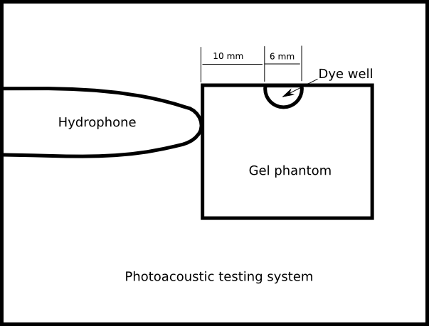

References: 

1. PROGRESS REPORT YEAR 1 R24, Subproject: Photoacoustic Neuroimaging
2. Yuan, et. al., [Emission and absorption properties of indocyanine green in
Intralipid solution](http://www.ncbi.nlm.nih.gov/pmc/articles/PMC1533769/) J Biomed Opt. 2004; 9(3): 497–503. doi:  10.1117/1.1695411

The photoacoustic neuroimaging subproject has recently measured the photoacoustic response of various pH sensitive dyes. Their experimental setup is diagrammed below. A preamplifier extension to the hydrophone is not shown. The labeled distances are my estimates based on their text and hydrophone specs. They are approximate.

<center><br/>
</center></br>

Response is presented in terms of millivolts per millijoule. I provisionally assume millivolts to refer to preamp output and millijoules to refer to the laser source. To inform simulations, I would like to convert these figures to excitation and response at the dye well.

Since the laser beam directly impacts the well through an essentially transparent path (whether air or gel,) I'll assume full power of the beam arrives at the gel. Approximating the well as a hemisphere 3mm in radius, its volume would be $\frac{2}{3}\pi 3^3 = 56.5\:mm^3$. Assuming the well is full of dye solution, 1 mJ of energy input corresponds to an energy density of $$\frac{1}{56.5} = 0.0177\:mJ/mm^3 = 17.7\:\mu J/mm^3 = 17.7\:kPa.$$

Preamp specs indicate a broadband gain of 20 dB, a factor of 10 in amplitude. Thus, voltage at the hydrophone will be on the order of 10% of that at preamp output. Hydrophone sensitivity (depending on the exact model) is either $8\:nV/Pa$ or $45\:nV/Pa.$ I'll use $10\:nV/Pa$ as an order of magnitude. Thus a millivolt, or $10^6\:nV$ at preamp output corresponds to $\approx 10^5\:nV$ at the hydrophone output, or $10^4\:Pa$ at the hydrophone input.

Energy density will incur an $r^2$ loss between the surface of the well and the hydrophone input 10mm away. Its magnitude will be roughly $\left(\frac{3}{3+10}\right)^2 = 0.053.$ Thus $10^4\:Pa$ at the hydrophone input corresponds to $\frac{10^4}{0.053} = 188679.2 \approx 189 \:kPa$ at the well.

In sum:

* A millivolt at preamp output corresponds to $\approx 189\:kPa$ at the well.
* A millijoule of laser input corresponds to $\approx 17.7\:\mu J/mm^3 = 17.7\:kPa$ of energy density at the well.
* To convert from $mV/mJ$ in the report to $kPa/(\mu J/mm^3)$ at the well, multiply the former by $\frac{189}{17.7} = 10.68 \approx 10.$
* Since $\mu J/mm^3$ and $kPa$ are identical units, $kPa/(\mu J/mm^3)$ is actually a dimensionless quantity representing the ratio of excitation energy density to response energy density--a measure of efficiency.

Using the factor of 10 approximation, figures 1 through 3 in the report can be coverted to a ratio at the dye well easily. For instance, the 10 $\mu M$ panel of Figure 3 would be converted to the following.

```{r echo=FALSE, fig.align='center', fig.show='hold'}
ph57 <- read.csv("../data/ph5_7.csv")
ph65 <- read.csv("../data/ph6_5.csv")
ph75 <- read.csv("../data/ph7_5.csv")
temp <- rbind(ph57,ph65,ph75)
plot(range(temp[,1]), range(temp[,2]), type='n', xlab="Excitation wavelength (nm)", ylab="Energy density ratio:  response / incident", main=expression(paste("10 ", mu, "M ICG (Response at Varying pH")))
lines(ph57[,1], ph57[,2], col="blue", lwd=3)
points(ph57[,1], ph57[,2], col="blue", pch=18, cex=1.5)
lines(ph65[,1], ph65[,2], col="red", lwd=3)
points(ph65[,1], ph65[,2], col="red", pch=15, cex=1.5)
lines(ph75[,1], ph75[,2], col="green3", lwd=3)
points(ph75[,1], ph75[,2], col="green3", pch=17, cex=1.5)
legend('topright', c("pH 5.7", "pH 6.5", "pH 7.5"), lwd=3, col=c("blue", "red", "green3"), pch=c(18,15,17), cex=1.5)
```

The conversion does not apply to Figures 4 and 5 for which a skull bone phantom was introduced. 