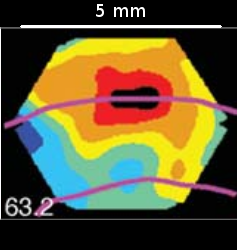

*Summary: This note dicusses Hodgkin-Huxley models of brain volumes involving multiple neurons and afferents. Preliminary simulations support the idea that single compartment Hodgkin-Huxley models can accurately simulate collective activity of volumes on millimeter scales. Although model dynamics are formally quadratic, they appear to behave almost linearly under reasonably realistic conditions. The average response of multiple compartments is closely approximated by the response of a single compartment to the average stimulus.*

According to the project proposal,

> we believe NIR fluorescence imaging can provide millimeter scale spatial resolution (on par with PET) Coupled with a superbly enhanced temporal resolution from the sub-hour scale in PET to real-time (sub-sec scale), this is expected to provide a transformative paradigm for in vivo imaging of the human brain.

Simulating and recovering spatio-temporal patterns of neuronal activity such as those recorded in craniotomized rodents have been discussed as an interim goal. Also according to the proposal,

> We may use the recent observation that the VSD signal at x can be lumped as a generalized single compartment representing the dominant neurons in the volume.

$$-C_M \frac{\partial V(x,t)}{\partial t} = g_E(x,t)(V(x,t)-E_E) + g_I(x,t)(V(x,t)-E_I) + g_L(x,t)(V(x,t)-E_L)\:\:(Eq. 3)$$

> where $g_E(x,t)$ and $g_I(x,t)$ are generalized excitatory and inhibitory conductances indicating the total neuronal input to the area located at x. [The third conductance, $g_L$ is a leak conductance--W.]

The recent observation cited refers indirectly to Petersen et. al., [Spatiotemporal Dynamics of Sensory Responses in Layer 2/3 of Rat Barrel Cortex Measured In Vivo by Voltage-Sensitive Dye Imaging Combined with Whole-Cell Voltage Recordings and Neuron Reconstructions](http://www.jneurosci.org/content/23/4/1298.long) in which whole cell recordings from individual neurons were found to be strongly correlated with bulk VSD signals: "response latencies and kinetics of membrane potential changes are very similar to the local VSD responses." The change in membrane potential, $\Delta V_m,$ was proportional to the fractional change, $\Delta F / F_0,$ in VSD fluorescence over baseline. The constant of proportionality varied significantly from animal to animal and experiment to experiment but, once known, could be used to predict $\Delta V_m$ with a standard deviation of 2 mV given VSD signals from a 0.2 mm by 0.2 mm region surrounding the body of a calibrated neuron.

Integration of Equation 3 with respect to $x$ would not, in general, result in an equation of the same form unless the conductances, $g_E(x,t),\:g_I(x,t),\:and\:g_L(x,t)$ and/or VSD signals, $V(x,t),$ were constant with respect to $x$ over the region of integration. Since Equation 3 has the essentially the same form as that of a Hodgkin-Huxley model for a single neuron, the observation suggests that neurons in a 0.2 mm square area (of layers 2 and 3) are behaving as if subject to approximately the same excitation, inhibition, and leakage.

Even applied to an individual neuron, Hodgkin-Huxley conductances will be different for its dendrites, body, and axons. However, the Hodgkin-Huxley model is a parallel electrical circuit, and a lumped, parallel arrangement of many such circuits will retain the form of Equation 3, provided the cell interior and exterior act as "wires" in which currents travel instantly from one point to another. This would not be true on time scales of milliseconds, hence a single compartment model might not apply, e.g., to generation and propagation of individual action potentials. But, from a theoretical viewpoint, the model could describe behavior at longer times scales.

It is surprising, however, that a single compartment model as in Equation 3 would describe the lumped behavior of multiple neurons. Though the exterior of multiple neurons might be modelled as a single wire over long time scales, their interiors are clearly isolated from one another: electrical currents, in the form of ions, cannot travel directly from the interior of one cell to the interior of another. Moreover, a small volume will contain, not only cell bodies, but afferents from other regions and cell types.

Practice trumps theory, of course, and in practice a lumped Hodgkin-Huxley model seems to apply at least over areas 0.2 mm on a side. Since one of the 6 neural layers in a $3\pm 1.5$ mm thick human cerebral cortex is between about  $(3 \pm 1.5)/6$ mm = $.5 \pm .25$ mm in depth, and Petersen et. al. (op. cit.) record from two layers (albeit of rat cortex), suppose we assume a Hodkins-Huxley model applies to areas of human cortex, 0.2 mm on a side and 2 layers, or $1 \pm .5$ mm, in depth.

In a simulation this assumption, taken at face value, would require about 25 compartments per 1 mm^3^ voxel, and, as can be seen from the figure below, sub-millimeter variations in VSD emissions are to be expected. However, the proposal aims for spatial resolution "on a par with PET," hence on the order of 3 mm. It would be convenient, therefore, if we could simulate at cruder spatial resolutions than 25 per voxel.

<center><br/><br/>
VSD signal from a ferret visual cortex.<br/>
Source: [Eriksson et. al. (2008)](http://journals.plos.org/plosone/article?id=10.1371/journal.pone.0002673)</center>

Function HH_model, in this project's file, /R/hodgkin_huxley.R, returns a solver for a single compartment, Hodgkin-Huxley model. Called without arguments, as below, it will create a model with default values, V0=-80, C=1, gl=0.045, Ee=0, Ei=-75, El=-80, where V0 is initial membrane potential.

```{r}
source("../R/hodgkin_huxley.R")
mdl <- HH_model()
```

The solver, `mdl`, is an R function which takes three arguments. The first is a vector of times (in milliseconds) at which samples of solution are desired. The remaining two represent excitation and inhibition conductances, ge and gi, as in Equation 3 above. Since the model is a single compartment, ge and gi do not vary spatially, but they are time varying. As such, they are assumed to be R functions of a single argument, time.

To illustrate, the following code calculates the model's response a pulse excitation conductance of 0.05 mS beginning at 10 msec and ending at 50 msec. The inhibition conductance is uniformly zero. The value of 0.05 mS corresponds to a rise time, C/ge, of 20 msec.

```{r}
ge <- function(t)0.05*(t >= 10 & t <= 50)
gi <- function(t)0.0
times <- seq(0, 100, by=1)
V <- mdl(times, ge, gi)
```

```{r fig.align='center', echo=FALSE, fig.show='hold', fig.width=4, fig.height=6}
par(mfrow=c(2,1))
matplot(times, cbind(ge(times), gi(times)), type='l', lwd=3, lty=1, xlab="t (msec)", ylab="conductance (mS)", main="Driving force", col=c("darkgreen", "red"))
legend('topright', c("ge", "gi"), lwd=3, lty=1, col=c("darkgreen", "red"))
plot(V[,1],V[,2], type='l', lwd=3, xlab="t (msec)", ylab="membrane potential (mV)", main="Response")
par(mfrow=c(1,1))
```

Suppose 5 such compartments were subjected to this same stimulus in sequence after a delay of, say, ten milliseconds per compartment. Would their mean response resemble the response of a single compartment to, say, the average stimulus?

```{r echo=FALSE, fig.align='center', fig.show='hold', fig.width=9}
times <- seq(0, 200, by=1)
V <-mdl(times, ge, gi)
for(i in 2:5){
  V <- cbind(V, mdl(times, function(t)ge(t-10*(i-1)), gi)[,2])
}
U <- mdl(times, function(t)(ge(t)+ge(t-10)+ge(t-20)+ge(t-30)+ge(t-40))/5, gi)
matplot(V[,1], V[,2:6], type='l', lty=1, col=2:6, xlab="t (msec)", ylab="membrane potential (mV)", main="Mean response of 5 compartments to delayed stimuli vs\nresponse of 1 compartment to mean stimulus")
lines(V[,1], rowMeans(V[,2:6]), lwd=3)
lines(U[,1], U[,2], lwd=3, lty=2)
legend('topright', c("Mean response", "Response to mean","0 msec delay", "10 msec delay", "20 msec delay", "30 msec delay", "40 msec delay"), lty=c(1,2,1,1,1,1,1), lwd=c(3, 3, rep(1,5)), col=c(1,1:5))
```

In this case the system of five compartments behaves almost linearly despite the quadratic terms, conductance times voltage, in its governing equation. Suppose five compartments are simultaneously subjected to stimuli which differ in magnitude. Will aproximate linearity hold then?

```{r echo=FALSE, fig.align='center', fig.show='hold', fig.width=9}
times <- seq(0, 200, by=1)
V <-mdl(times, ge, gi)
for(i in 2:5){
  V <- cbind(V, mdl(times, function(t).9^(i-1)*ge(t), gi)[,2])
}
U <- mdl(times, function(t)(sum(0.9^(1:5))*ge(t))/5, gi)
matplot(V[,1], V[,2:6], type='l', lty=1, col=2:6, xlab="t (msec)", ylab="membrane potential (mV)", main="Mean response to stimuli of different amplitudes vs\nresponse to mean stimulus")
lines(V[,1], rowMeans(V[,2:6]), lwd=3)
lines(U[,1], U[,2], lwd=3, lty=2)
legend('topright', c("Mean response", "Response to mean","x1", "x0.8", "x0.7", "x0.66", "x0.6"), lty=c(1,2,1,1,1,1,1), lwd=c(3, 3, rep(1,5)), col=c(1,1:5))

set.seed(1435610812) # System time at time of coding
W <- walks(50, .4, 5)
W <- W * 0.1/max(W)
ges <- gs(W)
```

Again, the system behaves with approximate linearity, hence the five compartments could be lumped into one. Consider the following excitation stimuli which were randomly generated, using convenient heuristics to control pairwise correlation and temporal smoothness.

```{r echo=FALSE, fig.align='center', fig.show='hold', fig.width=8}
matplot(t(rbind(colMeans(W), W)), type='l', lwd=c(3,1,1,1,1,1), lty=1, xlab="t (msec)", ylab="conductance (mS)", main="Randomly generated conductances with\ncontrolled correlation and smoothness")
legend("topleft", c("Mean", "1", "2", "3", "4", "5"), lwd=c(3,rep(1,5)), lty=1, col=1:6)
```

As the following plots show, the mean response of five compartments is again well approximated by the response of a single compartment to the mean stimulus. I have not done systematic trials, but this result is typical of the few trials I have done. So far, it appears that single compartment Hodgkin-Huxley models on millimeter scales would be adequate for present purposes. 

```{r echo=FALSE, fig.align='center', fig.show='hold', fig.width=8}
times <- seq(0, 100, by=1)
V <-mdl(times, ges[[1]], gi)
for(i in 2:5){
  V <- cbind(V, mdl(times, ges[[i]], gi)[,2])
}
U <- mdl(times, ges[[6]], gi)
matplot(V[,1], V[,2:6], type='l', lty=1, col=2:6, xlab="t (msec)", ylab="membrane potential (mV)", main="Mean response to randomly generated stimuli vs\nresponse to mean stimulus")
lines(V[,1], rowMeans(V[,2:6]), lwd=3)
lines(U[,1], U[,2], lwd=3, lty=2)
legend('topright', c("Mean response", "Response to mean", "Response to 1", "Response to 2", "Response to 3", "Response to 4", "Response to 5"), lty=c(1,2,1,1,1,1,1), lwd=c(3, 3, rep(1,5)), col=c(1,1:5))
```


