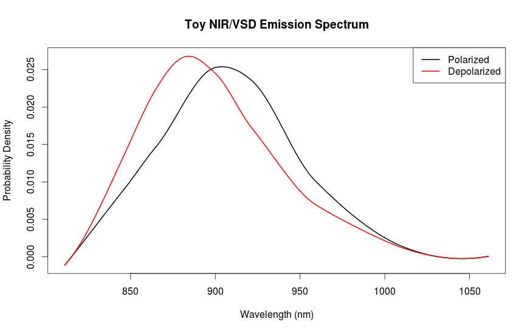

# Know brainR

#### Incidental R code for imaging in vivo neurotransmitter modulation of brain network activity in real time. 

#### Notes in reverse chronological order
-   [What's going on here?](Rmds/summary_7_15.html)
-   [Estimating safe concentration of VSD](Rmds/safe_dose.html)
-   [Simulation of neuronal activity, III](Rmds/scoping_v1_III.html)
-   [Simulation of neuronal activity, II](Rmds/scoping_v1_II.html)
-   [Voxel level statistics for stained gray matter](Rmds/vox_stats_stained_gray.html)
-   [Simulated VSD spectra](Rmds/sim_vsd_spectra.html)
-   [Foveal area of BrainWeb phantom's primary visual cortex](Rmds/foveal_17.html)
-   [Analysis of photoacoustic response to pulsed excitation](Rmds/acoustic_2.html)
-   [Voxel Level Statistics](Rmds/voxel_level_stats.html)
-   [Scoping simulation of neuronal activity in the visual cortex](Rmds/scoping_v1.html)
-   [Summary, May 1 2015](Rmds/summary_5_15.html)
-   [Acoustic time of flight vs distance](Rmds/tof_vs_distance.html)
-   [Does optical scattering obscure direction?](Rmds/scattering_and_direction.html)
-   [Model of acoustic loss](Rmds/acoustic_1.html)
-   [Improved phantom display](Rmds/using_disp_slice.html)
-   [Acoustic properties for BrainWeb phantom](Rmds/acoustic_properties.html)
-   [NIR absorption, ballpark estimates](Rmds/absorption.html)
-   [Reading BrainWeb Phantoms](Rmds/reading_brainweb.html)
-   [Optical Indices of Refraction](Rmds/Grey_to_White.html)
-   [Energy Density Estimate](Rmds/energy_density.html)
-   [Photon Diffusion in Gray Matter](Rmds/diffusion_in_gray.html) (in progress)
-   [Optical Properies of Tissue](Rmds/jacques.html)
-   [Reconstruction by Linear Regression](Rmds/optimal_reconstruction.html)
-   [Discrete estimation of eigenvalues and spatial resolution](Rmds/discrete_methods.html)
-   [Spatial Resolution of \~1 cm Estimated](Rmds/spatial_resolution.html)
-   [Estimated Loss and Dispersion of Photons](Rmds/loss.html)
-   [Estimated Rate of NIR Emission](Rmds/emissions.html)
-   [The Head is Quiet in Near Infrared](Rmds/thermal_noise.html)

Know brainR maintained by [WilCrofter](https://github.com/WilCrofter)

[Download this project as a .zip file](https://github.com/WilCrofter/know_brainR/zipball/master)

[Download this project as a tar.gz file](https://github.com/WilCrofter/know_brainR/tarball/master)

[View on GitHub](https://github.com/WilCrofter/know_brainR)

\
This work is licensed under a [Creative Commons
Attribution-NonCommercial-ShareAlike 3.0 United States
License](http://creativecommons.org/licenses/by-nc-sa/3.0/us/).

Published with [GitHub Pages](http://pages.github.com)
